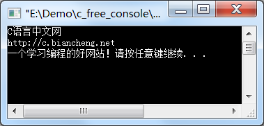

# C语言fgets和fputs函数的用法详解（以字符串的形式读写文件）

fgetc() 和 fputc() 函数每次只能读写一个字符，速度较慢；实际开发中往往是每次读写一个字符串或者一个数据块，这样能明显提高效率。

## 读字符串函数 fgets

fgets() 函数用来从指定的文件中读取一个字符串，并保存到字符数组中，它的用法为：

```c
char *fgets ( char *str, int n, FILE *fp );
```

str 为字符数组，n 为要读取的字符数目，fp 为文件[指针](http://c.biancheng.net/c/80/)。

返回值：读取成功时返回字符数组首地址，也即 str；读取失败时返回 NULL；如果开始读取时文件内部指针已经指向了文件末尾，那么将读取不到任何字符，也返回 NULL。

注意，读取到的字符串会在末尾自动添加 '\0'，n 个字符也包括 '\0'。也就是说，实际只读取到了 n-1 个字符，如果希望读取 100 个字符，n 的值应该为 101。例如：

```c
#define N 101
char str[N];
FILE *fp = fopen("D:\\demo.txt", "r");
fgets(str, N, fp);
```

表示从 D:\\demo.txt 中读取 100 个字符，并保存到字符数组 str 中。

需要重点说明的是，在读取到 n-1 个字符之前如果出现了换行，或者读到了文件末尾，则读取结束。这就意味着，不管 n 的值多大，fgets() 最多只能读取一行数据，不能跨行。在C语言中，没有按行读取文件的函数，我们可以借助 fgets()，将 n 的值设置地足够大，每次就可以读取到一行数据。

【示例】一行一行地读取文件。

```c
#include <stdio.h>
#include <stdlib.h>
#define N 100
int main(){
    FILE *fp;
    char str[N+1];
    if( (fp=fopen("d:\\demo.txt","rt")) == NULL ){
        puts("Fail to open file!");
        exit(0);
    }
   
    while(fgets(str, N, fp) != NULL){
        printf("%s", str);
    }
    fclose(fp);
    return 0;
}
```

将下面的内容复制到 D:\\demo.txt：

> C语言中文网
> http://c.biancheng.net
> 一个学习编程的好网站！

那么运行结果为：


fgets() 遇到换行时，会将换行符一并读取到当前字符串。该示例的输出结果之所以和 demo.txt 保持一致，该换行的地方换行，就是因为 fgets() 能够读取到换行符。而 gets() 不一样，它会忽略换行符。

## 写字符串函数 fputs

fputs() 函数用来向指定的文件写入一个字符串，它的用法为：

```c
int fputs( char *str, FILE *fp );
```

str 为要写入的字符串，fp 为文件指针。写入成功返回非负数，失败返回 EOF。例如：

```c
char *str = "http://c.biancheng.net";
FILE *fp = fopen("D:\\demo.txt", "at+");
fputs(str, fp);
```

表示把把字符串 str 写入到 D:\\demo.txt 文件中。

【示例】向上例中建立的 d:\\demo.txt 文件中追加一个字符串。

```c
#include<stdio.h>
int main(){
    FILE *fp;
    char str[102] = {0}, strTemp[100];
    if( (fp=fopen("D:\\demo.txt", "at+")) == NULL ){
        puts("Fail to open file!");
        exit(0);
    }
    printf("Input a string:");
    gets(strTemp);
    strcat(str, "\n");
    strcat(str, strTemp);
    fputs(str, fp);
    fclose(fp);
    return 0;
}
```

运行程序，输入`C C++ Java Linux Shell`，打开 D:\\demo.txt，文件内容为：

> C语言中文网
> http://c.biancheng.net
> 一个学习编程的好网站！
> C C++ Java Linux Shell